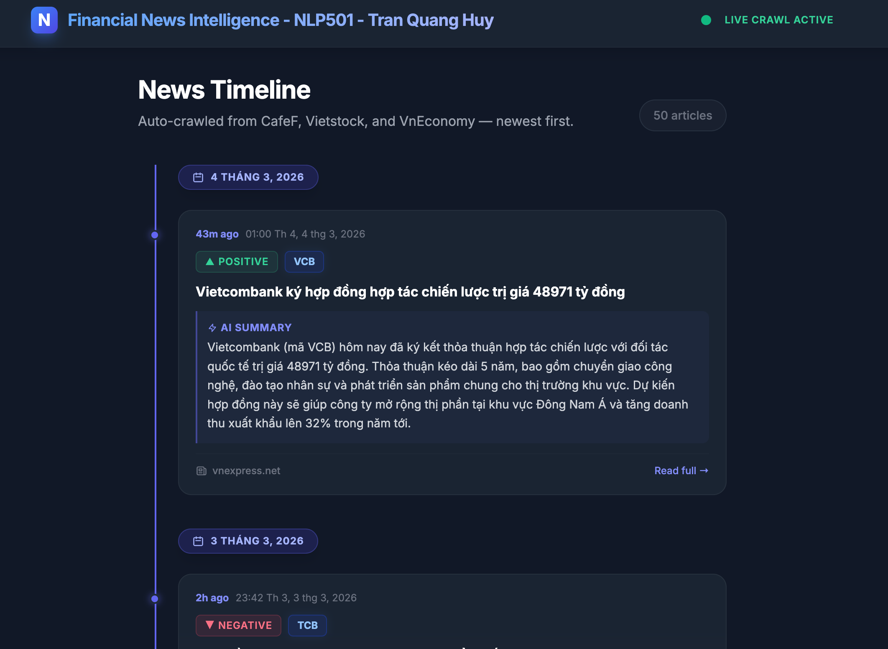
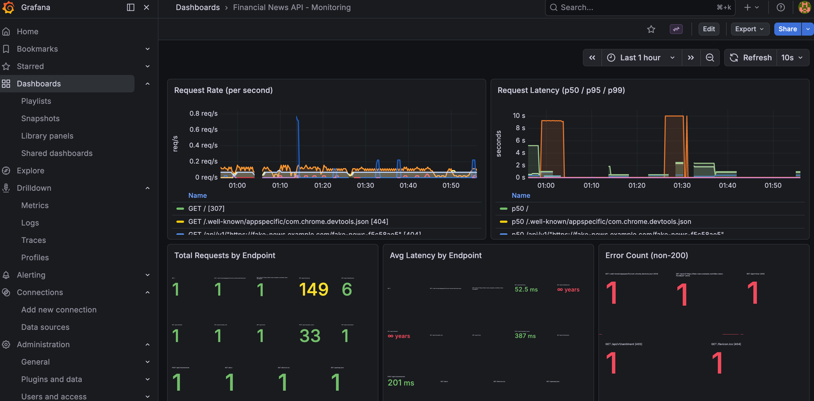

# Financial News Intelligence (NLP501 Final Project)



An **end-to-end NLP system** for Vietnamese financial news — from RSS ingestion through AI summarization, sentiment analysis, and stock ticker extraction, all served via a real-time dashboard and monitored with a full MLOps stack.

## Key Features

| Feature | Implementation |
|---|---|
| **Abstractive Summarization** | BiLSTM Encoder + LSTM Decoder with Bahdanau Attention, Beam Search decoding, extractive fallback |
| **Sentiment Analysis** | PhoBERT (`vinai/phobert-base`) fine-tuned for 3-class sequence classification |
| **Named Entity Recognition** | Hybrid: rule-based VN30 dictionary + PhoBERT token classification |
| **Semantic Deduplication** | PhoBERT embeddings with cosine similarity threshold (0.85) |
| **Live Dashboard** | Single-column timeline with auto-polling, modal article view, sentiment badges |
| **Data Ingestion** | Scheduled RSS scraping (VnExpress, VnEconomy) every 3 minutes via APScheduler |
| **MLOps Stack** | MLflow (experiment tracking & model registry), Prometheus (metrics), Grafana (monitoring) |
| **Database** | SQLite with SQLAlchemy ORM |
| **API** | FastAPI + Uvicorn with on-the-fly NLP fallback |

## Tech Stack

- **Language:** Python 3.10–3.13
- **Deep Learning:** PyTorch, HuggingFace Transformers
- **Web Framework:** FastAPI, Uvicorn
- **Tokenizer:** PhoBERT BPE (`vinai/phobert-base`)
- **Database:** SQLite + SQLAlchemy
- **Infrastructure:** Docker Compose (MLflow, Prometheus, Grafana)
- **Evaluation:** ROUGE (HuggingFace `evaluate`), seqeval, scikit-learn

## Getting Started

### Prerequisites
- Python 3.10–3.13
- Docker and Docker Compose (for MLOps stack)

### 🚀 Quick Start

The fastest way to launch everything (Docker MLOps containers, venv, ingestion scheduler, and FastAPI server):

```bash
chmod +x start_all.sh
./start_all.sh
```

This will:
1. Start MLflow, Prometheus, and Grafana via Docker Compose
2. Create a Python virtual environment and install dependencies
3. Launch the RSS ingestion scheduler in the background (scrapes every 3 min)
4. Start the FastAPI server on `localhost:8000`

Press `Ctrl+C` to gracefully shut down all components.

### 🔧 Manual Setup

```bash
# 1. Start MLOps containers
docker compose up -d

# 2. Set up Python environment
python3 -m venv venv
source venv/bin/activate
pip install -r requirements.txt

# 3. Start the API server
export PYTHONPATH=$(pwd)
uvicorn src.api.main:app --host 0.0.0.0 --port 8000

# 4. (Optional) Start the ingestion scheduler in a separate terminal
export PYTHONPATH=$(pwd)
python src/ingestion/scheduler.py
```

## 💡 Using the System

### 1. Live NLP Dashboard

Navigate to **[http://localhost:8000/api/v1/dashboard](http://localhost:8000/api/v1/dashboard)** (or just `/` which redirects here).

The dashboard features:
- **Timeline layout** with date grouping and auto-refresh every 10s
- **Sentiment badges** (▲ Positive / ▼ Negative / ▬ Neutral)
- **Stock ticker badges** auto-extracted by the NER model
- **AI Summary** block with extractive summarization
- **Modal popup** for reading the full original article content

### 2. Interactive API Docs (Swagger UI)

Open **[http://localhost:8000/docs](http://localhost:8000/docs)** to explore and test all endpoints interactively.

### 3. Test via Terminal (cURL)

```bash
curl -X POST http://localhost:8000/api/v1/predict_event \
  -H 'Content-Type: application/json' \
  -d '{"text": "Cổ phiếu FPT tăng mạnh sau báo cáo tài chính tích cực trong quý 3."}'
```

### 4. Monitoring & MLOps

- **Grafana:** [http://localhost:3000](http://localhost:3000) (login: `admin`/`admin`) — pre-provisioned dashboard with request rate, latency percentiles (p50/p95/p99), and error tracking
- **MLflow:** [http://localhost:5001](http://localhost:5001) — experiment tracking and model registry
- **Prometheus:** [http://localhost:9090](http://localhost:9090) — raw metrics collection
- **API Metrics:** [http://localhost:8000/metrics](http://localhost:8000/metrics) — Prometheus scrape target



### 🌐 API Endpoints

| Endpoint | Method | Description |
|---|---|---|
| `/api/v1/dashboard` | GET | Live auto-updating NLP dashboard |
| `/api/v1/articles` | GET | Latest 50 articles with on-the-fly NLP fallback |
| `/api/v1/predict_event` | POST | Combined pipeline (Summary + Sentiment + NER) |
| `/api/v1/summarize` | POST | Abstractive summarization only |
| `/api/v1/sentiment` | POST | Sentiment classification only |
| `/api/v1/ner` | POST | Stock ticker extraction only |
| `/api/v1/health` | GET | Health check |
| `/api/v1/model_info` | GET | Model source info (MLflow Registry vs local) |
| `/metrics` | GET | Prometheus metrics (request counts & latencies) |

### 🧪 Generating Fake Data

Generate synthetic Vietnamese financial news to test the full pipeline without waiting for real RSS articles:

```bash
source venv/bin/activate
export PYTHONPATH=$(pwd)
python scripts/generate_fake_data.py --count 10
```

- Creates realistic articles with randomized stock tickers, financial figures, and sentiment
- Pushes through the same ingestion pipeline (Summarization + Sentiment + NER) as real data
- Saves original generated data to a timestamped log file in `logs/fake_data/`
- Supports 9 article templates (3 positive, 3 negative, 3 neutral) across 6 VN30 tickers

> **Note:** The API server must be running on `localhost:8000` for NLP processing to work.

### 🧠 Training the Models

```bash
source venv/bin/activate
export PYTHONPATH=$(pwd)

# Summarization (BiLSTM Seq2Seq)
python src/summarization/train.py

# Sentiment (PhoBERT fine-tuning)
python src/sentiment/train_sentiment.py

# NER (PhoBERT token classification)
python src/ner/train_ner.py
```

Training metrics are automatically logged to MLflow at [http://localhost:5001](http://localhost:5001). Best models are registered to the MLflow Model Registry and promoted to Production stage.

## Project Structure

```
├── src/
│   ├── api/                  # FastAPI app, routes, Tailwind dashboard
│   ├── ingestion/            # RSS scraper, APScheduler
│   ├── summarization/        # Seq2Seq model (encoder, decoder, attention, beam search, inference)
│   ├── sentiment/            # PhoBERT sentiment training & prediction
│   ├── ner/                  # Hybrid NER (dictionary + PhoBERT)
│   ├── deduplication/        # Semantic embedder & cosine similarity
│   ├── preprocessing/        # Text cleaner & tokenizer
│   ├── evaluation/           # ROUGE evaluation
│   ├── database.py           # SQLAlchemy engine & session
│   └── models.py             # Article ORM model
├── scripts/
│   ├── generate_fake_data.py # Synthetic data generator
│   ├── register_models.py    # MLflow model registration
│   ├── crawl_sentiment_*.py  # Data collection scripts
│   └── crawl_vn30_ner.py     # NER data collection
├── models/                   # Saved model weights & tokenizer configs
│   ├── sentiment/            # PhoBERT sentiment model
│   ├── ner/                  # PhoBERT NER model
│   └── summarizer/           # Seq2Seq summarizer
├── configs/
│   ├── prometheus.yml        # Prometheus scrape config
│   └── grafana/              # Grafana provisioning & dashboards
├── mlops/                    # MLflow tracking, Prometheus metrics middleware
├── notebooks/                # Training notebooks (Jupyter)
├── data/                     # Raw, processed, and split datasets
├── docs/                     # Architecture & report documentation
├── tests/                    # Pytest unit tests
├── docker-compose.yml        # MLflow + Prometheus + Grafana
├── start_all.sh              # One-command system launcher
└── requirements.txt          # Python dependencies
```
